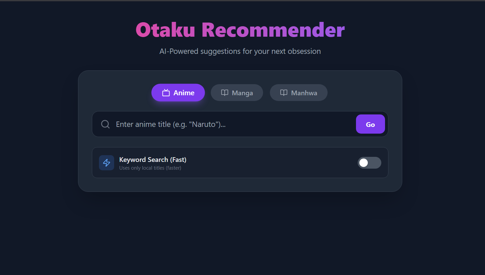
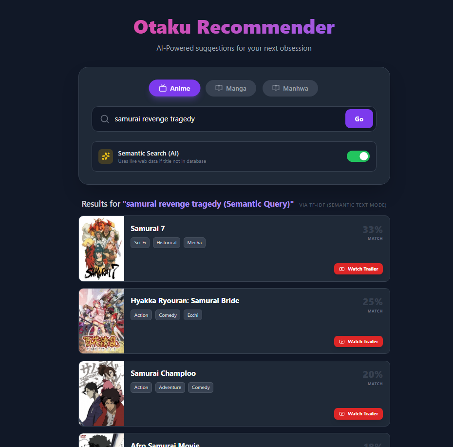
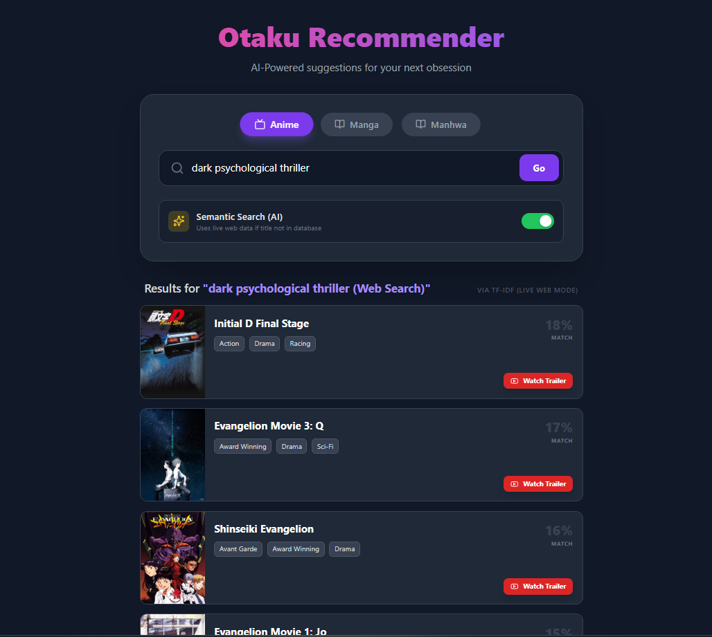

<p align="center">
  
</p>

<h1 align="center">🎴 Otaku Recommender — Full-Stack AI Engine</h1>

<p align="center">
  AI-powered recommendations for Anime, Manga, and Manhwa  
  <br>
  Semantic Search • TF-IDF • Live Web Mode • FastAPI • React
</p>

<p align="center">

  <!-- Deployment Badges -->
  <a href="https://anime-multi-recommendation-engine.vercel.app">
    
  </a>

  <a href="https://anime-recommender-i8w3.onrender.com">
    
  </a>

  <!-- Tech -->
  
  
  

  <!-- License -->
  

</p>

---

# ⚠️ Free Hosting Notice (Important)

This project uses **free-tier hosting**:

- **Frontend:** Vercel Free  
- **Backend:** Render Free (auto-sleeps)

Because of this:

### 🕒 The backend may take **5–20 seconds** to wake up after inactivity.

To make this smooth, the UI displays:

> **“Warming up the Otaku Engine…”**

This delay is normal on free hosting.  
Once the backend wakes up, performance is fast.

---

# 🌟 Overview

Otaku Recommender is an AI-powered system that understands:

- Titles  
- Themes  
- Moods  
- Vibes  
- Natural language descriptions  

It provides high-quality anime/manga/manhwa recommendations using:

- **TF-IDF semantic similarity**
- **Smart Text Mode (no API required)**
- **Live Web Fallback (Jikan API)**
- **React + FastAPI full-stack architecture**

🔗 **Frontend (Vercel):**  
https://anime-multi-recommendation-engine.vercel.app  

🔗 **Backend API (Render):**  
https://anime-recommender-i8w3.onrender.com  

---

# ✨ Key Features

## 1️⃣ Smart TF-IDF Brain  
Every item uses a vector built from:

- Title  
- Genres  
- Description  

This allows matches based on **theme & vibe**, not only keywords.

---

## 2️⃣ Semantic Text Mode (Natural Language)

If the query looks like a *description*, the engine interprets it semantically.

Examples:

- *sad story about a pianist*  
- *dark psychological thriller*  
- *samurai revenge tragedy*  
- *wholesome romance with comedy*  

✔ Works offline  
✔ No API required  
✔ Fast and lightweight  
✔ Great for vibe-based searching  

**API label:** `TF-IDF (Semantic Text Mode)`

---

## 3️⃣ Live Web Mode (Jikan API)

Used only when:

- Query resembles a title  
- Not found in dataset  
- Smart mode ON  

The backend:

1. Fetches from Jikan  
2. Builds a synthetic description  
3. Computes similarity  

**API label:** `TF-IDF (Live Web Mode)`

---

## 4️⃣ Multi-Media Support

- Anime  
- Manga  
- Manhwa  

Each uses its own universe.

---

## 5️⃣ Infinite Discovery UX

Clicking a recommendation card → instantly triggers a new search.  
Creates endless recommendation loops.

---

## 6️⃣ YouTube Trailer Button

Each card includes one-click trailer search.

---

# 🌟 Showcase

## 🏠 Homepage UI
<p align="center">
  
</p>

---

## 🗡️ “samurai revenge tragedy”
<p align="center">
  
</p>

---

## 🧠 “dark psychological thriller”
<p align="center">
  
</p>

---

# 🧠 Tech Stack

### Frontend
- React (Vite)
- Tailwind CSS
- Framer Motion
- Lucide Icons
- Hosted on Vercel

### Backend
- FastAPI  
- TF-IDF + cosine similarity  
- Jikan API  
- Hosted on Render  

*(No heavy models like BERT — optimized for free-tier memory.)*

---

# 🚀 Running Locally

## 1️⃣ Backend

```bash
python -m venv .venv
source .venv/bin/activate   # Windows: .venv\Scripts\activate

pip install -r requirements.txt
uvicorn api:app --reload
Backend runs at:

cpp
Copy code
http://127.0.0.1:8000
Endpoints
Path	Description
/health	Status check
/recommend	Recommendation engine
/docs	Swagger UI

Example:

bash
Copy code
curl "http://127.0.0.1:8000/recommend?media_type=anime&query=naruto&topn=5&use_smart_search=true"
2️⃣ Frontend
bash
Copy code
cd frontend
npm install
npm run dev
Runs at:

arduino
Copy code
http://localhost:5173
To connect to local backend:

js
Copy code
const BACKEND_URL = "http://127.0.0.1:8000";
🧬 Project Structure
css
Copy code
Otaku-Recommender/
├── api.py
├── recommender.py
├── data/
├── frontend/
│   ├── src/
│   │   ├── App.jsx
│   │   └── main.jsx
│   └── tailwind.config.js
├── docs/
└── README.md
🔍 Recommendation Logic Summary
Mode	Trigger	Label
Local Title Match	Exact or substring match	TF-IDF (Local Title Match)
Semantic Text Mode	Descriptive prompt	TF-IDF (Semantic Text Mode)
Live Web Mode	Unknown title + smart mode	TF-IDF (Live Web Mode)
Smart Mode OFF	Not found	Friendly 404

📜 License — Dual Licensing (IMPORTANT)
This project uses Dual Licensing:

🔓 GPLv3 (Free)
You may use this project only if your project is also open-source under GPLv3.

💼 Commercial License (Paid)
Required for:

Closed-source apps

Commercial products

SaaS platforms

Business integrations

📩 Contact for licensing:
borboranabil.dev@outlook.com

🙌 Credits
Built with ❤️ by borboranabil
Powered by FastAPI, React, TF-IDF, and Jikan API
