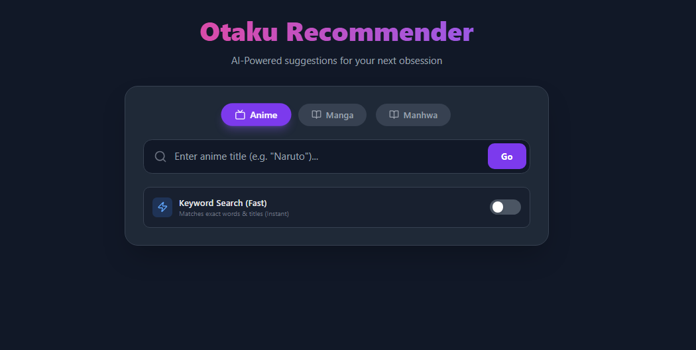
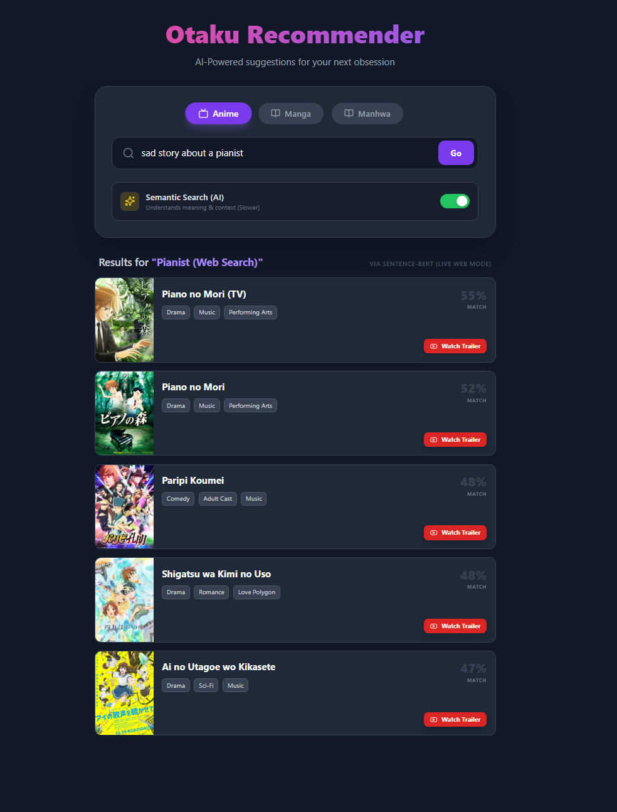

# 🎌 Otaku Recommender - Full-Stack AI Engine

> **A Next-Gen Recommendation System for Anime, Manga, and Manhwa.**
> Powered by Hybrid AI (TF-IDF + Sentence-BERT), FastAPI, and React.

<p align="center">
  
  
  
  
</p>

## ✨ What makes this special?

Unlike standard recommendation engines that only suggest items from a fixed list, **Otaku Recommender** is "Alive."

1.  **🧠 Hybrid AI Brain:** Uses **TF-IDF** for instant keyword matching and **Sentence-BERT** for deep semantic understanding (finding anime with similar *vibes*, not just similar words).
2.  **🌍 Live Internet Fallback:** If you search for an anime that isn't in the database (e.g., a brand new release), the system automatically **scrapes the internet**, analyzes the plot in real-time, and generates recommendations instantly.
3.  **🖱️ "Infinite Discovery" UI:** Click any recommendation to instantly pivot the search to that title, creating an endless rabbit hole of content.
4.  **🎬 Smart Integration:** Includes official posters and "Watch Trailer" buttons for every title.

---

## 📸 Screenshots

| Dark Mode UI | Natural Language Search |
|:---:|:---:|
|  |  |
| **Clean Dark Mode Interface** | **AI understands "sad story about a pianist"** |

### Live Internet Fallback & Trailers

*Automatically fetches data, posters, and trailers for unknown titles.*

---

## 🛠️ Tech Stack

### **Frontend (The Face)**
* **Framework:** React (Vite)
* **Styling:** Tailwind CSS (Dark Mode)
* **Animations:** Framer Motion (Smooth transitions)
* **Icons:** Lucide React

### **Backend (The Brain)**
* **API:** FastAPI (Python)
* **ML Models:** `scikit-learn` (TF-IDF), `sentence-transformers` (BERT)
* **Data Handling:** Pandas, Pickle (Caching)
* **Live Data:** Jikan API (MyAnimeList)

---

## 🚀 How to Run Locally

### 1. Backend Setup (Python)
The backend handles the AI logic and data processing.

```bash
# 1. Install dependencies
pip install -r requirements.txt

# 2. Download the "Universe Database" (9,000+ items with images)
# Note: This takes ~15 minutes but only needs to be run once.
python get_ultimate_db.py

# 3. Start the Server
uvicorn api:app --reload
The backend runs at: http://127.0.0.1:8000

2. Frontend Setup (React)
The frontend provides the interactive Netflix-style interface.

Bash

cd frontend

# 1. Install libraries
npm install

# 2. Start the App
npm run dev
The app runs at: http://localhost:5173

📂 Project Structure
Anime-Multi-Recommendation-Engine/
├── api.py                 # The Brain (FastAPI Server)
├── recommender.py         # The Logic (AI Models)
├── get_ultimate_db.py     # The Robot (Data Downloader)
├── data/                  # 9,000+ Anime/Manga CSVs + Cache
└── frontend/              # React Application
    ├── src/
    │   ├── App.jsx        # Main UI Code
    │   └── main.jsx       # Entry Point
    └── tailwind.config.js # Styling Config
🔮 Future Roadmap
[x] Phase 1: Build TF-IDF Engine

[x] Phase 2: Upgrade to Sentence-BERT (Semantic Search)

[x] Phase 3: Full Stack Migration (FastAPI + React)

[x] Phase 4: Live Internet Search & Poster Integration

[ ] Phase 5: User Accounts & "Watch List" (Coming Soon)

[ ] Phase 6: Deploy to Vercel/Render

📝 License
Distributed under the MIT License.
